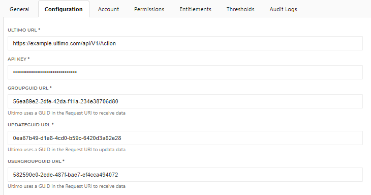

# HelloID-Conn-Prov-Target-Ultimo

##### Note!  This connector is not fully tested yet

## Table of contents

* [Introduction](#Introduction)
* [Prerequisites](#Prerequisites)
* [Getting started](#Getting-started)
  * [Configuration Settings](#Configuration-Settings)
  * [Design considerations](#Design-considerations)

---

## Introduction

Ultimo is a flexible Enterprise Asset Management (EAM) Cloud platform with a SOAP-based web service to programmatically interact with its data. 
The HelloID target connector can create and update Ultimo-Accounts and grand permissions to Ultmio-Groups based on the connectors created in Ultimo

Note that this connector is based on a test environment provided by one of our customers At the moment of writing, the import connector does not work fully functional. The web service now only returns a message and does not actually modifies ultimo. (This may cause, adjustments needed in the create and update scrip) So the code base is not fully tested.

---

## Prerequisites

 - Credentials to authorize with Ultimo
 - Import and Export connectors in Ultimo (These connectors are customer-specific and usually created by Ultimo consultants)

---

## Getting started

#### Configuration Settings
 
You must enter the URL and the API key of your Ultimo Environment. And besides that, you will need a GUID of objects to specify the request endpoint. This GUID refers to an object in the Connector in Ultimo.
So there is a GUID to get the groups, get the Users, and one for the update calls. You must specify these in the configuration of your Connector.

---

## Design considerations

- Account Create will creating the user
- Account Delete will only revoke the groupAssignment
- Account Disable and Enable are not used. This is not possible in Ultimo

- Permission Grand, assign the Group to a Ultimo user   (A Ultmio user can be member of one group at the time. One to one relation)
- Permission Revoke is not used, because when you receive a new Group/Entitlement. HelloID triggers both events at the same time (Assignment of the new and revoke of the old assignment). With might result in ending up with an account without an entitlement. When the Grand event is first processed and the revoke event will eventually remove the entitlement again.

---
